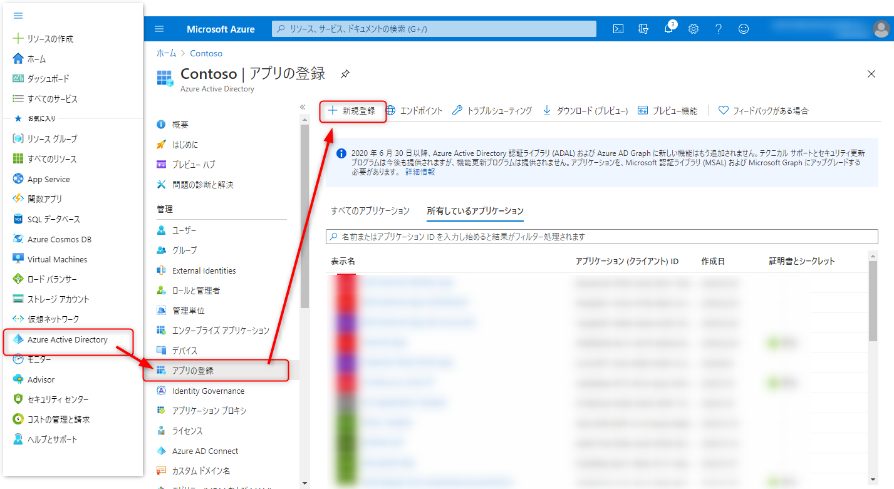

# Get last-sign-in activity  reports

Shows how to download last sign-in log  on Azure AD  with PowerShell

PowerShell スクリプトにて、ユーザー毎に最終サインイン日時を取得する方法を紹介します。
なお、ユーザーが最後に利用したアプリケーションを取得するためには Azure AD Premium P1 ライセンス以上が必要です。

## Azure AD におけるユーザーの最終サインイン日時

2020/10 現在 Beta 版ではございますが、最終サインイン日時が取得可能となりました

本スクリプトでは、Beta 版の Microsoft Graph API で取得可能な [SingInActivity](https://docs.microsoft.com/ja-jp/graph/api/resources/signinactivity?view=graph-rest-beta) データをもとに最終サインイン日時を取得します。

## 本スクリプトで取得する最終サインイン日時について

本スクリプトでは SignInActivity よりユーザーの最終サインインを取得し、サインイン ログから最終サインイン時にアクセスしたアプリケーションを表示しています。そのため、以下の点を予めご留意ください。

- アプリケーション情報については、サインインのログから取得しているため、 30 日以上経過している場合にはアプリケーション情報は取得できません。

## 最終サインイン日時の取得手順

本スクリプトは、証明書を利用して最終サインイン日時を取得します。証明書はシークレットよりも安全であり推奨される方法です。

### 1.事前準備

ダウンロードした PowerShell スクリプトを実行するため、以下のコマンドで ExecutionPolicy を RemoteSign に設定します。

```powershell
Set-ExecutionPolicy RemoteSigned
```

[スクリプト一式](https://github.com/jpazureid/get-last-signin-reports/archive/use-signin-activity-beta-api.zip) をダウンロードし、任意の場所 (以下では C:\SignInReport) に展開します。

#### 認証に使用する証明書の作成

CreateAndExportCert.ps1 を実行します。

CreateAndExportCert.ps1 は自己署名証明書を生成し、ユーザーの証明書ストア (個人) に格納します。さらに、公開鍵を含む証明書 (SelfSignedCert.cer ファイル) をカレント  ディレクトリに出力します。キーを利用する場合はこの手順をスキップします。

 GetModuleByNuget.ps1 を実行します。

#### Microsoft Graph SDK for PowerShell のインストール

Microsoft Graph SDK for PowerShell をインストールします。
ローカル管理者権限で PowerShell を起動し、以下のコマンドを実行します。
すでにインストール済みであれば、手順をスキップします。

```powershell
Install-Module -Name Microsoft.Graph
```

### 2.アプリケーションの登録

Azure AD 上にアプリケーションを準備します。

#### アプリケーションの登録

- Azure ポータルに管理者権限でサインインし、[Azure Active Directory] > [アプリの登録] より、[+新規登録] をクリックします。



- 任意の名前を選択し、登録を選択します。 


- 表示される概要欄にて、アプリケーション ID とテナント ID を控えておきます。


#### API のアクセス許可の設定

- [API のアクセス許可] に移動し、[アクセス許可の追加] をクリックします。


- [Microsoft Graph] を選択します。


- [アプリケーションの許可] を選択します。


- "User.Read.All" のチェックを有効にします。


- 続けて "AuditLog.Read.All" のチェックを有効にし、[アクセス許可の追加] をクリックします。


- [<テナント名> に管理者の同意を与えます] をクリックします。


- 確認メッセージで [はい] をクリックし、管理者の同意を付与します。


- <テナント名> に付与されました、と表示されていれば完了です。


#### 証明書の登録

証明書を登録します。

- [証明書とシークレット] 画面に移動します。


##### 証明書の登録手順

- [証明書のアップロード] をクリックし、表示されるフォルダーボタンをクリックします。ここで、 "1. 認証に使用する証明書の作成" で作成した、 SelfSignedCert.cer を指定します。


- 証明書をアップロード後、 [追加] をクリックします。


### 3. スクリプトの実行

最後に、C:\SignInReport 配下に保存した Get-LastSignIn.ps1 を、環境に合わせて引数を調整し実行します。

> クライアント ID はアプリの登録手順で取得したアプリケーション ID を指定します。
> テナント ID は上記のようにドメイン形式で入力いただくか、アプリケーション ID 同様 GUID 形式で入力いただいても結構です。

証明書の場合：

```powershell
.\Get-LastSignIn.ps1 -CertigicateThumbprint <手順 1 でアップロードした証明書の拇印の値> -TenantId 'contoso.onmicrosoft.com' -ClientId xxxxxxxx-xxxx-xxxx-xxxx-xxxxxxxxxxxx -Outfile "C:\SignInReport\lastSignIns.csv"
```

アプリや証明書を指定しない場合、デバイス フローでのサインインが求められます。
グローバル管理者権限※ でサインインすることでもデータの取得が可能です。

コマンドを実行した際に表示されるメッセージに従い <https://microsoft.com/devicelogin> にアクセスし、表示されたコードを入力しサインインを実施します。

```powershell
.\Get-LastSignIn.ps1
# Disconnect Graph...
# Connecting Graph...
# Client credentail is not provided. Connect-Graph as Administrator account...
# To sign in, use a web browser to open the page https://microsoft.com/devicelogin and enter the code SSF83XSJM to authenticate.
```

> ※ Graph SDK への同意のためには、一度グローバル管理者でサインインし、管理者の同意を実行する必要があります。
### 実行結果

GetLastLogin.ps1 を実行すると、ユーザー毎に最終サインイン日時が csv ファイルとして取得できます。


