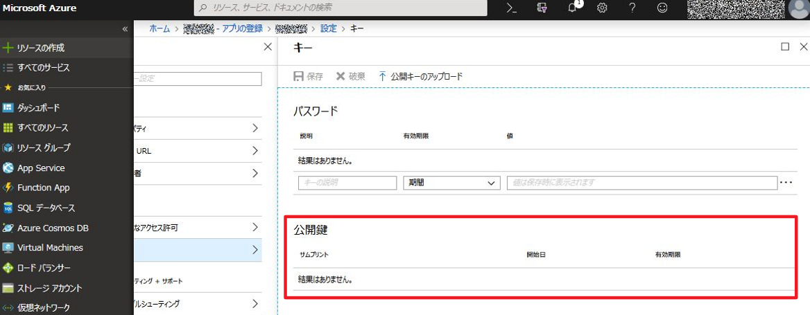

# Get last-sign-in activity  reports
Shows how to download last sign-in log  on Azure AD  with PowerShell

PowerShell スクリプトにて、ユーザー毎に最終サインイン日時を取得する方法を紹介します。なお、本方法を利用するにはAzure AD Premium P1 ライセンス以上が必要です。


## Azure AD におけるユーザーの最終サインイン日時
現在のAzure AD には、ユーザーの最終サインイン日時を保持するプロパティがないため、ユーザーがいつ最後にサインインしたかという時刻を取得することはできません。Azure AD の開発チームは、プロパティの作成を検討しておりますが、明確な機能追加の時期は発表されていません。

そのため、一時的な対処策となりますが、ユーザー毎に最終ログイン日時を取得する方法をご用意いたしました。


## 本スクリプトで取得する最終サインイン日時について

本スクリプトではサインインログよりユーザーの最終サインインを取得しています。そのため、以下の点を予めご留意が必要です。

- サインイン ログの保存期間により、30 日以上前のサインイン日時は確認できません。
- サインインのログから一覧を取得しているため、厳密な ”最終アクセス日時” とは異なります。

## 最終サインイン日時取得手順

### 1. 認証に使用する証明書の作成
CreateAndExportCert.ps1 を実行します。

最終サインイン日時の取得にトークン取得に証明書を用います。これは、これまでの平文のキーを用いる方法よりもセキュリティ的に強固であり、推奨している方法です。CreateAndExportCert.ps1 は自己署名証明書を生成し、ユーザーの証明書ストア (個人) に格納します。さらに、公開鍵を含む証明書 (SelfSignedCert.cer ファイル) をカレント  ディレクトリに出力します。

### 2. 処理に必要なライブラリを nuget で取得するスクリプトの準備と実行
GetModuleByNuget.ps1 を C:\SignInReport フォルダー配下に保存し実行します。

証明書を用いたトークン取得処理に必要なライブラリを nuget で取得します。
GetModuleByNuget.ps1 を実行すると、C:\SignInReport 配下に Tools というフォルダーが作成され Microsoft.IdentityModel.Clients.ActiveDirectory.dll などのファイルが保存されます。

 
### 3. アプリケーションの登録
Azure AD 上にアプリケーションを準備します。

以下のドキュメントに記載された手順に従って、アプリケーションを登録し、"構成設定を収集する" に従ってドメイン名とクライアント ID を取得します。

Azure AD Reporting API にアクセスするための前提条件  
https://docs.microsoft.com/ja-jp/azure/active-directory/active-directory-reporting-api-prerequisites-azure-portal


今回はアプリケーションのクライアント シークレットとして証明書を利用します。そのため、 上記の公開情報では "アプリケーションのクライアント シークレットを取得する" の手順において 5 でキーを生成していますが、その代わりに [公開キーのアップロード] を実行します。ここで、 "1. 認証に使用する証明書の作成" で作成した、 SelfSignedCert.cer を指定してアップロード後、 [保存] をクリックします。

 

### 4. スクリプトの実行

最後に、GetLastLogin.ps1 を C:\SignInReport 配下に保存し、環境に合わせて以下部分の内容を設定します。

```powershell
$tenantId = "yourtenant.onmicrosoft.com" # or GUID "01234567-89AB-CDEF-0123-456789ABCDEF"
$clientID = "XXXXXXXX-XXXX-XXXX-XXXX-XXXXXXXXXXXXX"
$thumprint = "XXXXXXXXXXXXXXXXXXXXXXXXXXXXXXXXXXXXXXXX"
$outfile = "C:\Users\xxxxx\Desktop\lastLogin.csv"
```

GetLastLogin.ps1 を実行すると、ユーザー毎に最終サインイン日時が csv ファイルとして取得できます。


